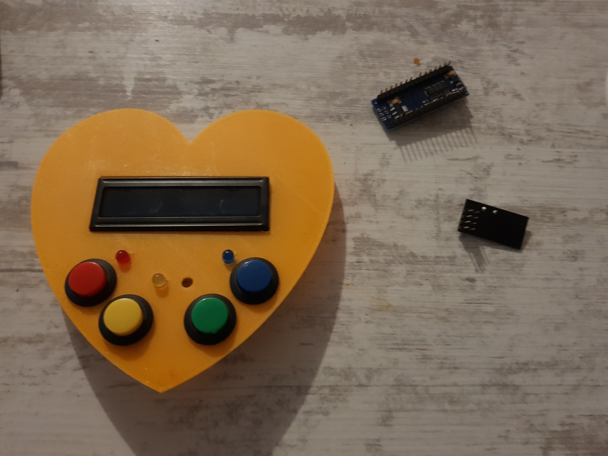

# GAMEGIRL
## Introduction
A very simple Game console for girls based on arduino Nano.

The console features :
- 4 color buttons with 4 color leds
- A 16X2 LCD screen for displaying menu and game information
- A Buzzer for music
- An On/Off switch
- A 9V battery as power source

For this version, the console has the form of a heat. I created it for my little daughter. Feel free to rebuild it with your own form and code your own games.

The console has a game registration mechanism, a Highscore saving in EEPROM, and integrates my RTTTL Music playing library (that you can find in my other repository) with the possibility of multitasking led animation (using PMW) with button reading screen updates and audio playing.

## GAMEGIRL RECIPE
### General recipe
To build a GAMEGIRL, you need :
- A shell (be creative)
- Buttons
- LEDS
- An arduino board (we prefer using the little ones like the arduino nano)
- An i2C LCD screen (can be graphical or just character based, it depends on the kind of games you are building)
- A Buzzer to make some noise
- A 9V battery + 9V battery connector + A On/Off switch
- Wires (Lot of wires)
- Software to pilot all of this

## GAMEGIRL V 1.0 recipe
GAMEGIRL V1.0 is a simple leds/buttons game with 4leds and 4buttons as well as an alphanumeric 16X2 screen to show score, live and stuff as well as select games and view highscores.

To build it, here is what you need to do:
0. 3D print the parts froml the STL files
1. Use a hot glue to glue the i2C LCD screen inside the heart position
2. Insert the buttons and the leds in the holes (maybe you need to use a solder tool to widen the holes if the leds don't fit). The pattern is from left to right : red, yellow, green, blue.
3. Connect all ground legs of the buttons together as well as the cathodes of the leds and add a 250Ohms resistor before the ground.  
4. Glue the Arduino nano at the upper-right side of the heart
5. Solder all leds and buttons to the arduino nano pins D2 to D9:
    1. D2 -> red button
    2. D3 -> red led
    3. D4 -> yellow button
    4. D5 -> yellow led
    5. D6 -> green button
    6. D7 -> green led
    7. D8 -> blue button
    8. D9 -> blue led
6. Solder the ground to the arduino ground
7. Connect the arduino SDA/SCL (A4/A5) of I2C to the corresponding pins on the I2C LCD.
8. Connect Vcc pin of the 9V battery connector to the VIN pin of the arduino nano.
9. Connect the GND pin of the 9V battery connector to the GNG pin of the arduino nano.
10. Cut the VCC line of the barrery wire and solder the ON/OFF Switch.
11. Glue the buzzer to the top right part of the heart.
12. Solder one of the buzzer legs to the D11 pin and the other one to the GND. You may want to add a potentiometer between the leg and ground to control volume.
13. Glue the back model to the bottom part of the shell after passing the battery connector inside.
14. Connect the battery.
15. Glue the bottom part of the shell with the top part.
16. Be free to stick decorations on the console.
17. Connect the USB connector to the console
18. Use Arduino IDE to load the code GAME_GIRL.ino to the arduino nano.
19. Have fun and try to maximize your scores.

## Some photos
Here are different components installed into the top part of the console:

And here is the final product:

